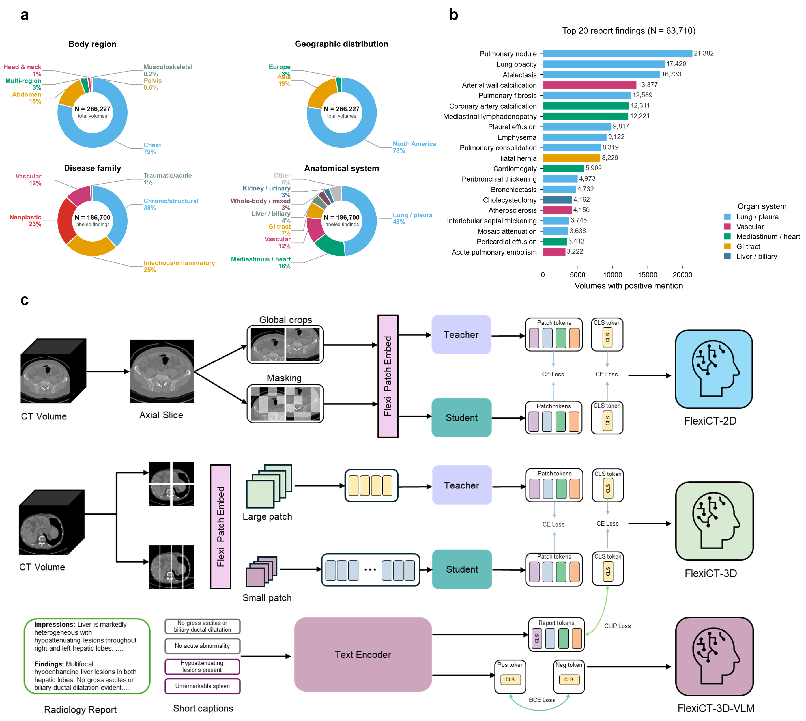

# FlexiCT

<p align="center">
  <a href="https://ricklisz.github.io/flexict.github.io/"></a>
  <a href="https://arxiv.org/abs/2605.21906"></a>
  <a href="https://huggingface.co/ricklisz123/FlexiCT"></a>
</p>

FlexiCT is a CT foundation model family trained through agglomerative continual
pretraining, progressing from 2D slice-level anatomy to 3D volumetric reasoning
and report-aligned vision-language understanding.

The released model family includes `FlexiCT-2D`, `FlexiCT-3D`, and
`FlexiCT-3D-VLM`. The models were trained on 266,227 CT volumes from 56 public
datasets and evaluated across segmentation, registration, classification,
clinical retrieval, and vision-language tasks.



## Demos and notebooks

| Notebook | What it shows |
|---|---|
| [`inference_demo.ipynb`](inference_demo.ipynb) | Minimal inference for `FlexiCT-2D`, `FlexiCT-3D`, and `FlexiCT-3D-VLM`, including synthetic smoke inputs and optional user CT paths. |
| [`visualization.ipynb`](visualization.ipynb) | Feature visualization, PCA maps, and similarity maps using the sample CT assets in `assets/`. |

Launch either notebook from the repository root:

```bash
jupyter lab inference_demo.ipynb
jupyter lab visualization.ipynb
```

## Checkpoints

Download the checkpoint you need and pass its local path explicitly or through
the environment variables documented below.

| Model | Model size | PyTorch checkpoint |
|---|---:|---|
| `FlexiCT-2D` | 144M parameters | [Download](https://drive.google.com/file/d/1nUj2RCsNQfOAncMYY5S-YgQthteoAdSM/view?usp=drive_link) |
| `FlexiCT-3D` | 144M parameters | [Download](https://drive.google.com/file/d/1Y599UnO4ab-vJCVhn5eOI8fECoHVWRyv/view?usp=drive_link) |
| `FlexiCT-3D-VLM` | 741M parameters | [Download](https://drive.google.com/file/d/1VXKbaIaViTXq26k8FfcscC5wxh7VxKrm/view?usp=drive_link) |

## Local installation

Use Python 3.11 and run commands from the repository root.

```bash
conda create -n flexict python=3.11 -y
conda activate flexict
cd /path/to/FlexiCT
python -m pip install --upgrade pip
python -m pip install -r requirements.txt
```

## Using checkpoints

Pass a checkpoint path when constructing a model:

```python
from flexi_ct import Flexi_CT_3D

model = Flexi_CT_3D(checkpoint_path="/path/to/ct_3d_teacher.pth")
```

You can also set environment variables once per shell session:

```bash
export FLEXICT_2D_CHECKPOINT=/path/to/ct_2d_teacher.pth
export FLEXICT_3D_CHECKPOINT=/path/to/ct_3d_teacher.pth
export FLEXICT_VLM_CHECKPOINT=/path/to/ct_3d_vlm.pth
```

`Flexi_CT_VLM` uses the Qwen3 embedding text tower, so its tokenizer and config
files are loaded from Hugging Face unless already cached. For offline or shared
systems, point `HF_HOME` to the cache location:

```bash
export HF_HOME=/path/to/huggingface_cache
```

## Quick validation

After installation, run a quick import check:

```bash
python -c "import torch; from flexi_ct import Flexi_CT_2D, Flexi_CT_3D, Flexi_CT_VLM; print(torch.cuda.is_available(), 'OK')"
```

Constructing a model loads the selected checkpoint.

## Downstream workflows

Downstream examples are provided under [`downstream/`](downstream/) for
segmentation, registration, retrieval, classification, and VLM evaluation.

For segmentation experiments, see
[`downstream/segmentation/README.md`](downstream/segmentation/README.md) for the
nnU-Net setup and dataset directory conventions.

For retrieval reproduction commands, see
[`downstream/retrieval/README.md`](downstream/retrieval/README.md).

## Citing this work

Please cite the arXiv preprint:

```bibtex
@article{li2026universal,
  title={Universal CT Representations from Anatomy to Disease Phenotype through Agglomerative Pretraining},
  author={Li, Yuheng and Gao, Yuan and Dong, Haoyu and Lai, Yuxiang and Wang, Shansong and Safari, Mojtaba and Baciak, James E and Yang, Xiaofeng},
  journal={arXiv preprint arXiv:2605.21906},
  year={2026}
}
```

## License and disclaimer

Code in this repository is released under the [MIT License](LICENSE).

The released checkpoints are made available under the
[Creative Commons Attribution-NonCommercial-NoDerivatives 4.0 International License](https://creativecommons.org/licenses/by-nc-nd/4.0/).
The pretrained weights may also be subject to the licenses and usage terms of
the original datasets used for training. Users intending to use FlexiCT in
commercial settings should verify dataset and model licensing and obtain any
required permissions.

FlexiCT is provided for research use. It is not a medical device and is not a
substitute for professional medical judgment.
